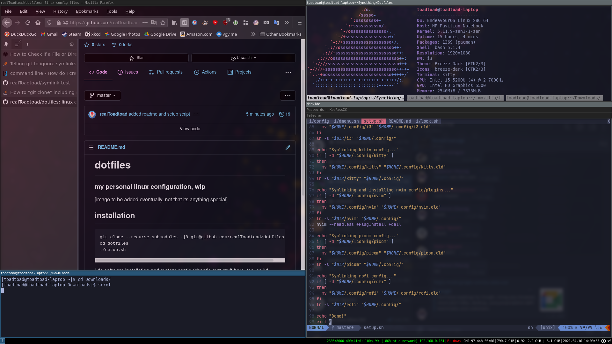

# dotfiles
### my personal linux configuration, wip



## installation
```
git clone --recurse-submodules -j8 git@github.com:realToadtoad/dotfiles.git
cd dotfiles
./setup.sh
```
i do software installation and system config (chaotic-aur) stuff here, too, so i'd recommend copying/symlinking the configs manually if possible; this repo was created for my personal use and really nothing else
